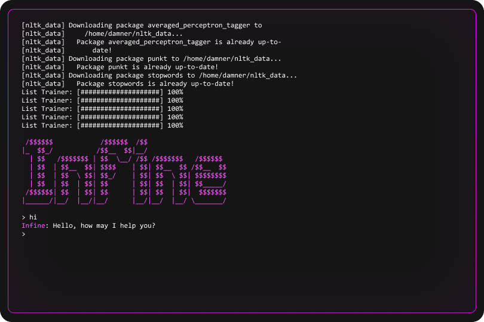

  

       

  1.0.0 (Beta)

---

# About

### Information

> Infine - is a simple chat bot on Python, made with chatterbot and pytz libraries. It's working like simple AI, it can learn on frases inside program. You can talk to it about something.

### Preview

---

